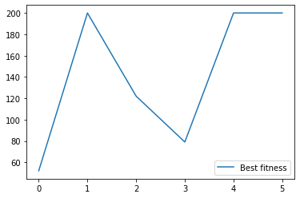
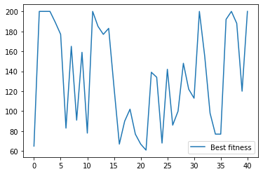

Summary
---

This is a NeuroEvolution implementation of solving the OpenAI Gym's Cartpole

In this implementation I generate a population of Neural Networks and 
randomly apply weights. I then implement a genetic algorithm to optimize the 
weights that yield the best results, instead of backpropogation.  

Completion
---
I set the goal to a score of 200 in any one 
episode and validate against 10 consecutive wins.

Results
---

The results vary in range from 10 episodes to completion to 200 episodes

